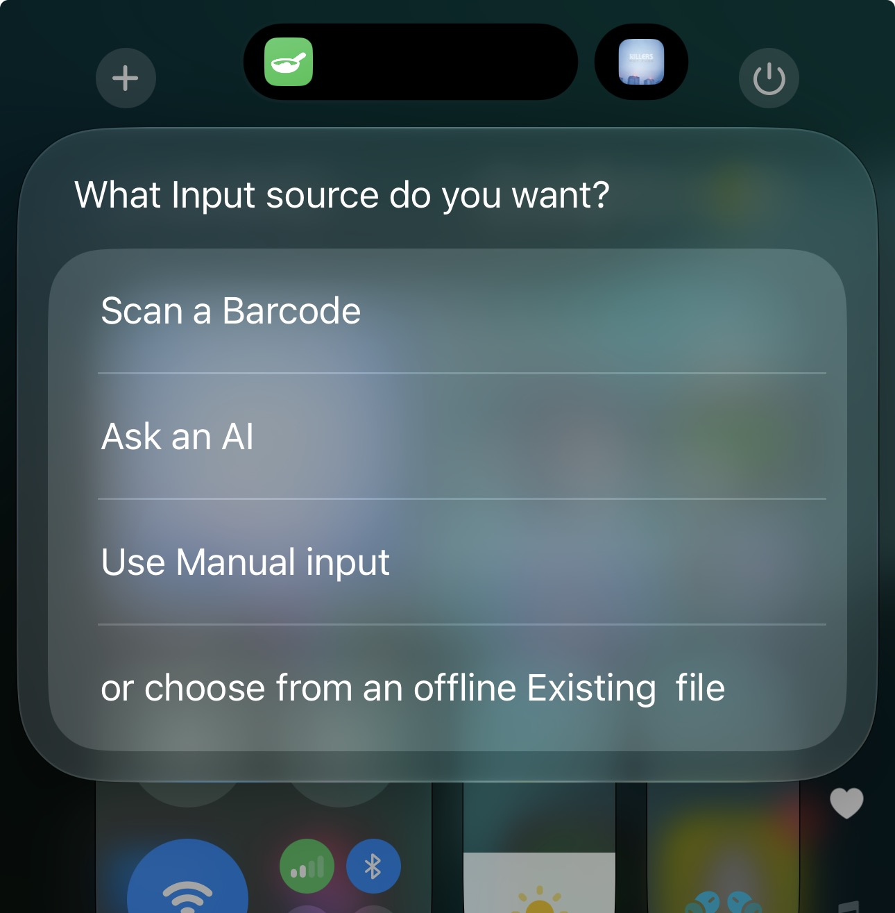
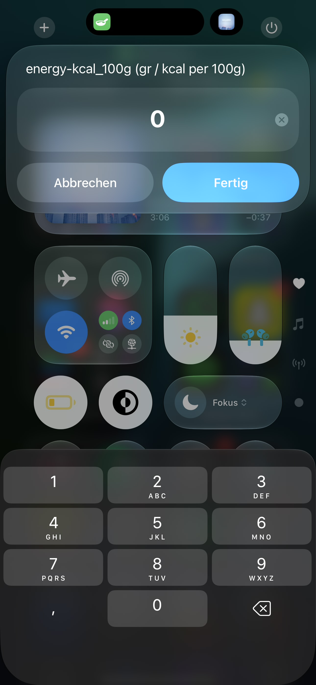
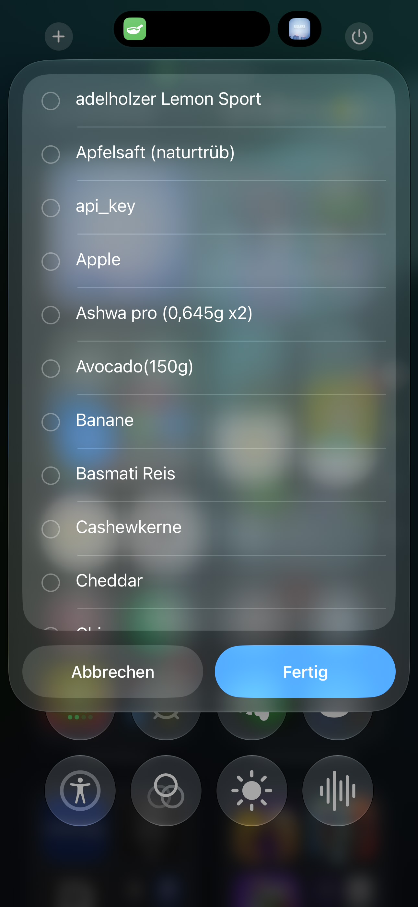
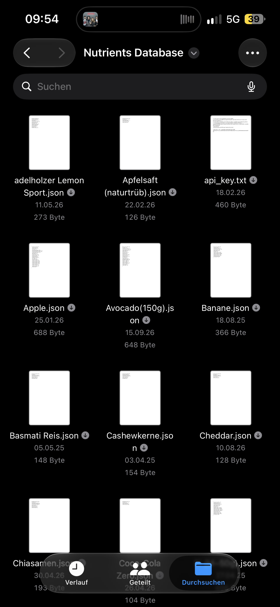
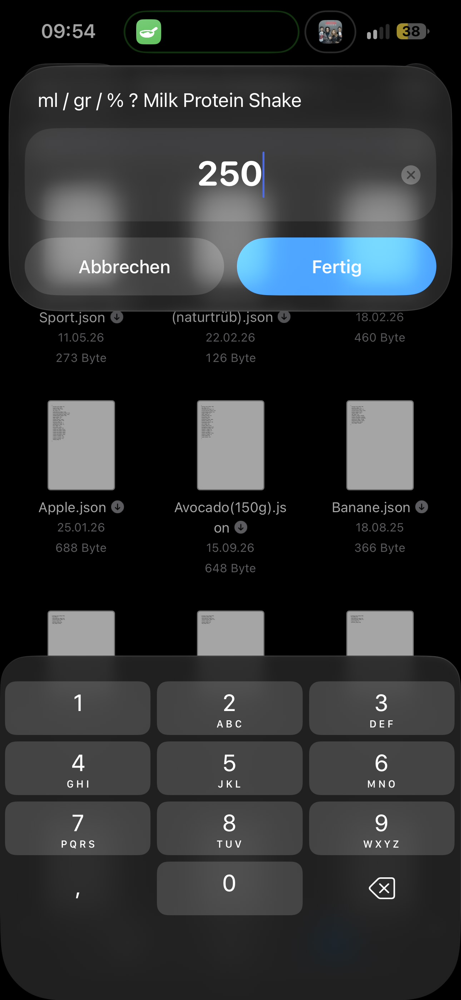
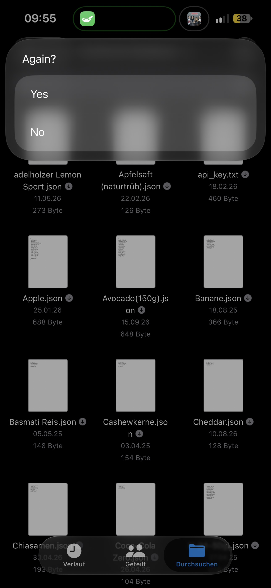
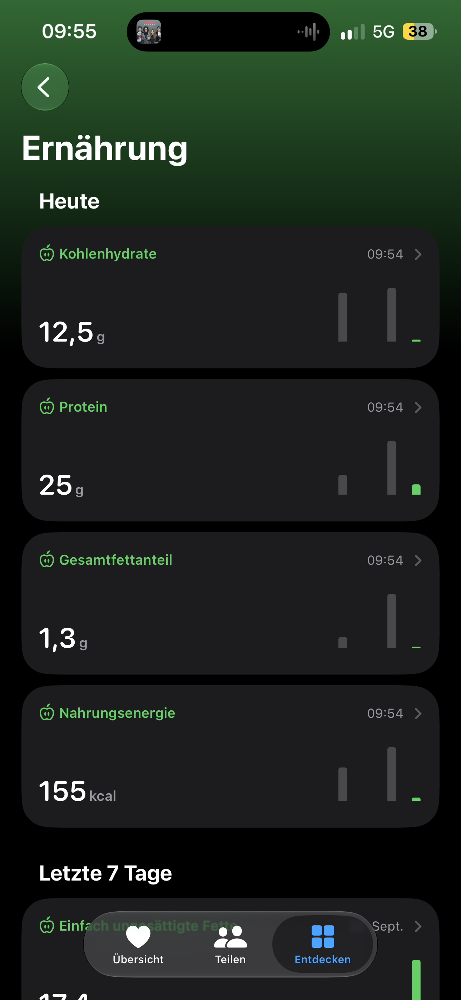

**Nutrition Tracker**

*https://routinehub.co/shortcut/21541/*

Your nutrition tracker is built directly into Apple Shortcuts and Apple Health.

Nutrition Tracker is an Apple Shortcut designed to make detailed nutrition tracking in Apple Health faster, reusable, and independent of a single data source.

*This shortcut works best with two my shorcuts:*

https://routinehub.co/shortcut/24903/

*and*

https://routinehub.co/shortcut/26329/

*check them out. README to them might drop soon too.*

**Nutrient tracker shortcut**

Food can currently be added using:

* 📷 Barcode Scan
* ✍️ Manual Input
* 🤖 AI
* 💾 Saved JSON files

Nutrition Tracker is built around one important principle:

Every input method produces the same nutrition JSON. Everything after that is shared.

Instead of creating a completely different Apple Health workflow for barcode scanning, AI, manual input, and saved foods, all sources are first converted into a standardized nutrition dictionary.

That dictionary is then used by the rest of the Shortcut.

The architecture can therefore be simplified to five major stages:

1. INPUT
      ↓
2. NORMALIZATION
      ↓
3. STORAGE
      ↓
4. PORTION CALCULATION
      ↓
5. APPLE HEALTH

...or more detailed like this:

             ┌────────────────────┐
             │  Nutrition Tracker │
             └─────────┬──────────┘
                       │
                        ▼
              Choose Input Method
                        │
       ┌────────────────┼────────────────┐───────────────┐       
    Barcode           Manual             AI         Saved JSON
       │                │                │               |
       │                │                │               |
       └────────–───────┴────────-───────┘─–─────────────┘
                        │
                        ▼
                Raw Nutrition Data
                        │
                        ▼
                     Formatting
                        │
                        ▼
              Standard Nutrition JSON
                        │
              ┌─────────┴──────────┐
              ▼                    ▼
         Save as JSON          Serving Size
                                   │
                                   ▼
                             Portion ÷ 100
                                   │
                                   ▼
                           Calculate Nutrients
                                   │
                                   ▼
                              Apple Health

⸻

1. Choosing an Input Method

When you start Nutrition Tracker, you choose how the food should be loaded.

The main options are:

Input	Purpose
Barcode Scan	Retrieve packaged food from Open Food Facts
Manual Input	Enter nutrition information yourself
AI	Estimate or extract nutrition information using AI
Saved JSON	Load a food that was previously saved

All of these methods eventually produce the same standardized nutrition dictionary.

⸻

2. Barcode Scan

Barcode scanning is intended primarily for packaged food.

Nutrition Tracker uses the device camera to scan the barcode.

The barcode is then sent to Open Food Facts to retrieve product information.

The Shortcut requests information such as:

product_name
nutriments

The nutriments dictionary can contain values such as:

* Energy
* Fat
* Saturated fat
* Carbohydrates
* Sugars
* Fiber
* Protein
* Sodium
* Potassium
* Calcium
* Magnesium
* Iron
* Zinc
* Vitamins
* and many other available nutrients

Not every Open Food Facts product contains every nutrient and not every food is available in the library. 

Nutrition Tracker therefore processes whatever information is available.

<!--  -->

⸻

Barcode Workflow

Scan Barcode
      ↓
Read Barcode Number
      ↓
Open Food Facts API (product_name + nutriments)
      ↓
.json adjustments
      ↓
Save / Continue

For example, the API data might eventually be converted into:

*{
  "food_name": "Example Food",
  "energy-kcal_100g": 361,
  "fat_100g": 6.7,
  "carbohydrates_100g": 56,
  "sugars_100g": 1.2,
  "fiber_100g": 11,
  "proteins_100g": 14
}*

These values describe the food per 100 g.

The actual amount eaten is calculated later.

⸻

3. Manual Input

Nutrition information can also be entered manually.

This is useful when:

* a product is missing from Open Food Facts,
* the database entry is incorrect,
* the food has no barcode,
* or you're offline

It will ask for every singe nutrient one after another. Its  grouped by measurement and after each group you will be ask if you want to skip the next one so you can skip the mg and/or µg nutrients.

The final .json will look something like this:

*{
  "food_name": "Homemade Granola",
  "energy-kcal_100g": 430,
  "fat_100g": 15,
  "saturated-fat_100g": 3,
  "carbohydrates_100g": 55,
  "sugars_100g": 12,
  "fiber_100g": 8,
  "proteins_100g": 13
}*

Missing nutrients do not prevent the food from being used.

Values that are unavailable can either be omitted during processing or represented as 0, depending on the specific part of the Shortcut.

⸻

4. AI Input

The AI mode is intended for food where reliable structured nutrition data is not immediately available.

like:

* Restaurant meals
* Homemade meals
* Mixed meals

<!--  -->

You will be asked to take a picture of the food and then you will hopefully get a structured JSON rather than normal conversational text.

For example:

*{
  "food_name": "Vegetable Pasta",
  "estimated_weight_in-gr": 450,
  "energy-kcal_100g": 142,
  "fat_100g": 4.2,
  "saturated-fat_100g": 1.1,
  "unsaturated-fat_100g": 3.1,
  "carbohydrates_100g": 20.5,
  "sugars_100g": 3.2,
  "fiber_100g": 2.8,
  "proteins_100g": 5.1
}*

Because the response follows the same format used by the rest of Nutrition Tracker, it can immediately enter the normal processing workflow.

The AI does not need to know anything about Apple Health, so you're information are still safely stored.

It only has to produce compatible nutrition JSON.

Nutrition Tracker handles everything after that.

Take Photo
     ↓
AI analyzes food
     ↓
Estimate food + nutrients
     ↓
Generate JSON
     ↓
Nutrition Tracker
     ↓
Serving Size
     ↓
Apple Health

When nutrition information is clearly visible on packaging, those visible values should be preferred over AI estimation whenever possible.

AI-generated values should always be treated as estimates when no verified data is available.

⸻

⸻

5. Saved JSON

Foods do not need to be downloaded, generated, or entered every time.

Once a food has been processed, its nutrition profile can be stored as a .json file.

For example:

Nutritients database folder/
│
├── Banana.json
├── Oatmeal.json
├── Greek Yogurt.json
├── Protein Powder.json
├── Milk.json
└── Pasta.json

A saved file for bananas could  contain:

*{
  "food_name": "Banana",
  "energy-kcal_100g": 89,
  "fat_100g": 0.3,
  "carbohydrates_100g": 22.8,
  "sugars_100g": 12.2,
  "fiber_100g": 2.6,
  "proteins_100g": 1.1
}*

When that food is selected later, Nutrition Tracker can skip:

* Barcode scanning
* Open Food Facts
* AI analysis
* Manual entry

and move directly to the serving-size calculation.

 the backend (the folder) will look like this 

⸻

6. Data Normalization

One of the most important parts of Nutrition Tracker is nutrient normalization.

Different databases, APIs and AI models do not always use the same property names.

For example, protein may appear as:

protein_100g

or:

proteins_100g

or:

Eiweiß_100g

or

Vitamin B1 might appear as:

*vitamin-b1_100g
thiamine_100g*

Instead of requiring every source to use exactly the same name, Nutrition Tracker can recognize multiple aliases and map them to the nutrient used internally.

it works like this:

*Eiweiß_100g* or *proteins_100g* ──► *Protein_100g*

Normalisation happens on multiple points inside of the shorcut for example after the barcode scan or just before the apple health log.

This makes Nutrition Tracker more compatible with:

* Open Food Facts API
* AI-generated JSON
* Manually generated JSON
* and much more

⸻

7. Nutrition JSON Format

The JSON dictionary is the central interface of Nutrition Tracker.

An example empthy food json may look like this:

{
  "food_name": "",
  "estimated_weight_in-gr": 0,
  "energy-kcal_100g": 0,
  "fat_100g": 0,
  "saturated-fat_100g": 0,
  "unsaturated-fat_100g": 0,
  "carbohydrates_100g": 0,
  "sugars_100g": 0,
  "fiber_100g": 0,
  "proteins_100g": 0,
  "salt_100g": 0,
  "sodium_100g": 0,
  "potassium_100g": 0,
  "chloride_100g": 0,
  "calcium_100g": 0,
  "magnesium_100g": 0,
  "iron_100g": 0,
  "zinc_100g": 0,
  "copper_100g": 0,
  "manganese_100g": 0,
  "phosphorus_100g": 0,
  "iodine_100g": 0,
  "chromium_100g": 0,
  "selenium_100g": 0,
  "molybdenum_100g": 0,
  "thiamine_100g": 0,
  "riboflavin_100g": 0,
  "niacin_100g": 0,
  "pantothenic-acid_100g": 0,
  "vitamin-a_100g": 0,
  "vitamin-b6_100g": 0,
  "vitamin-b12_100g": 0,
  "vitamin-c_100g": 0,
  "vitamin-d_100g": 0,
  "vitamin-e_100g": 0,
  "vitamin-k_100g": 0,
  "folate_100g": 0,
  "biotin_100g": 0,
  "cholesterol_100g": 0,
  "caffeine_100g": 0,
  "water_100g": 0,
  "creatine_100g": 0
}

The complete internal structure can contain additional fields and aliases beyond this example.

These can include values such as:

* Omega-3
* Omega-6
* Choline
* Fluoride
* Retinol
* Beta-carotene
* Different vitamin forms
* Electrolyte-related values
* Creatine
* Amino acids
* Additional supplement-related fields

The schema is intentionally broader than the values currently written to Apple Health.

Most nutrient keys follow:

nutrient_100g

For example:

*{
  "fat_100g": 6.7,
  "fiber_100g": 11,
  "proteins_100g": 14
}*

Energy uses:

*{
  "energy-kcal_100g": 361
}*

But Metadata does not necessarily use the _100g suffix - though those are optional for the shortcut:

*{
  "food_name": "Oatmeal",
  "estimated_weight_in-gr": 250
}*

⸻

8. Local Food Database (backend)

Every saved food becomes part of your personal food database, that is privately and safely stored in your own files.

The first time you add a food, you have to:

* scan it,
* manually enter it,
* or analyze it.

Afterwards, Nutrition Tracker can reuse the stored JSON.

Example:

First time:
*Barcode
   ↓
Open Food Facts
   ↓
Normalize
   ↓
Save Oatmeal.json
   ↓
Track*

but Later:

*Saved JSON
   ↓
Oatmeal.json
   ↓
Serving Size
   ↓
Track*

This reduces repeated API requests and makes frequently eaten foods significantly faster to log.

pro tipp: you can select multiple entries/foods now and they get run one after another.
⸻

9. Serving Size

Nutrition profiles are stored relative to 100 g.

After the food has been loaded, Nutrition Tracker asks for the amount actually consumed.

Example:

*How many grams did you eat?
250 g*

Nutrition Tracker calculates a serving factor:

*Serving Factor = Serving Size ÷ 100*

For 250 g:

*250 ÷ 100 = 2.5*

That factor is then applied to the available nutrition values.

 if you have supplements that are consumed in relatively tiny amounts, you should still input the normal serving size for those instead of scaling them up to 100g, 
but you have to enter 100g when you want to track them so it gets correctly added.
⸻

10. how to caluculate the nutritions

The general formula is:

Actual Nutrient =
*Nutrient per 100 g × (Serving Size ÷ 100)*

So Suppose a food contains:

*Protein = 14 g / 100 g*

and the serving is:

*250 g*

The Nutrition Tracker then calculates:

*14 × (250 ÷ 100) = 35 g*

It then repeats that step for every given nutrient for ONE food the shortcut 
performs a way to complicated if/else chain to match it with the corresponding 
apple health nutrient (again with a normalisation)- but more to that later...

After running through all elected foods the shortcut will then ask if you want to repeat the process incase you forgot something.

⸻

10. Apple Health

After the serving values have been calculated, compatible nutrients are passed to Apple Health.

Nutrition Tracker uses Apple Shortcuts’ Health logging functionality to create individual Health samples.

Each nutrient is handled separately.

For example:

Calculated Nutrition JSON
          │
          ├── Energy ──────► Apple Health
          ├── Protein ─────► Apple Health
          ├── Fiber ───────► Apple Health
          ├── Calcium ─────► Apple Health
          ├── Magnesium ───► Apple Health
          └── ...

This also makes the data available to compatible apps that read nutrition information from Apple Health, subject to the permissions the user has granted those apps.

⸻

11. Nutrients

Nutrition Tracker’s json data structure can contain a large number of nutritional values.

Macronutrients

* Energy
* Fat
* Saturated fat
* Unsaturated fat
* Carbohydrates
* Sugars
* Fiber
* Protein

Fat-related values

* Saturated fat
* Unsaturated fat
* Omega-3
* Omega-6
* Cholesterol

Minerals and Electrolytes

* Salt
* Sodium
* Potassium
* Calcium
* Magnesium
* Iron
* Zinc
* Copper
* Manganese
* Phosphorus
* Iodine
* Chloride
* Chromium
* Selenium
* Molybdenum
* Fluoride
* Electrolytes

Vitamins

* Vitamin A
* Vitamin B1 / Thiamine
* Vitamin B2 / Riboflavin
* Vitamin B3 / Niacin
* Vitamin B5 / Pantothenic acid
* Vitamin B6
* Vitamin B7 / Biotin
* Vitamin B9 / Folate
* Vitamin B12
* Vitamin C
* Vitamin D
* Vitamin E
* Vitamin K

Additional vitamin-related values can include:

(some of them are not in Apple Health yet but later more to that)
Which values Nutrition Tracker actually writes depends on the data available and the mappings implemented in the current Shortcut and Apple Health version.

* Retinol
* Beta-carotene
* Folic acid
* Individual vitamin D forms
* Individual vitamin K forms

Other Nutritional Values

* Water
* Caffeine
* Choline

Amino Acids and Sports Nutrition

* Creatine
* Leucine
* Isoleucine
* Valine

⸻

12. Why JSON?

JSON is used because it provides several important advantages.

One Common Interface

Every input method eventually creates the same type of object.

Barcode ─────┐
Manual ──────┤
AI ──────────┼──► JSON ───► Nutrition Tracker
Saved Food ──┤
Other App ───┘

⸻

**Offline Usage**

**Saved JSON files do not require a new API or AI request.**

One of the main advantages of local food storage is that already saved foods can continue to work without an internet connection.

Internet available
        │
        ├── Barcode
        ├── AI
        └── Manual Input
                │
                ▼
            Save JSON
                │
                ▼
        Local Food Database
                │
                ▼
               
          Serving Size
                │
                ▼
          Apple Health

          
Offline mode
        |
        ├── Manual Input
        └──  Load Saved JSON
                │
                ▼
        
          Serving Size
                │
                ▼
          Apple Health

An internet connection is therefore only required for AI or barcode use
 *(assuming that your standard shortcuts folder is either downloaded or on your device)*
⸻

Compatibility

JSON can easily be produced and processed by:

* Apple Shortcuts
* Cherri
* JavaScript
* Python
* APIs
* AI models
* Servers
* Other automation systems

⸻

Reusability

A food only needs to be defined once.

After that, the same file can be used for:

50 g
100 g
150 g
234.5 g
250 g
500 g
523 g
 
or any number between 0 and infinity, 
without changing the original nutritional profile.

⸻

13. Privacy

Nutrition Tracker itself is built using Apple Shortcuts, but privacy depends on which input method is used.

Local Operations

Operations such as:

* Reading saved JSON
* Selecting food
* Calculating serving sizes
* Normalizing locally available data
* Calculating nutrient values

can be performed locally.

The Files are securely stored in your Apple Files app, and this shortcut will only read the certain Data Base Folder.
It will never, ever read any of your private Health Data only write Nutritional ones.
⸻

Barcode Lookup

Barcode mode sends the product barcode to Open Food Facts so that product information can be retrieved.

⸻

AI

Using AI may send:

* Food descriptions
* Nutrition text
* Images
* Other provided input

to the selected AI provider.

The privacy policy of that provider applies.

AI is optional.

⸻

Apple Health

Nutrition Tracker requires permission before writing Health data.

Health permissions remain under the user’s control.

⸻

**14. Installation**

Requirements

Nutrition Tracker requires:

* Apple Shortcuts
* Apple Health
* A compatible iPhone or iPad for the required actions
* Permission to access the required Health categories

Internet access is additionally needed for certain features such as:

* Open Food Facts
* Online AI services

Saved foods can be reused without those online requests.

⸻

Install

[(https://routinehub.co/shortcut/21541/)]

Then:

1. Open the Nutrition Tracker link.
2. Add the Shortcut.
3. Run Nutrition Tracker.
4. Allow the required permissions.
5. Might run again to choose an input method.
6. Add or load a food.
7. Enter the amount consumed.
8. Allow Nutrition Tracker to save the supported values to Apple Health.

the search will always search for new updates every time you run it, so you might wanna allow 
it to acces another api
⸻

15. Permissions

Depending on the features used, Nutrition Tracker may request access to:

Permission	Used For
Internet is needed for the update and OpenFoodFacts APIs 
Camera access  is needed for the Barcode scanning and the AI photo estimation (last one is optional by the way)
Files	Saving and loading JSON foods
Apple Health to Log all nutrition information

You remain in control of which permissions are granted.

⸻

16. Using Another AI Service

ChatGPT is optional.

It is only used for AI-based nutrition analysis.

The rest of Nutrition Tracker does not depend on ChatGPT.

You can replace the AI section with another provider as long as the provider eventually returns compatible JSON.

Conceptually:

Nutrition Tracker
        ↓
AI Request
        ↓
Your AI Provider
        ↓
Nutrition JSON
        ↓
Normalization
        ↓
Nutrition Tracker

The important part is the output format, not which model generated it.

Possible AI sources include:

* ChatGPT
* Another online AI provider
* A local AI model
* A custom server
* A separate AI Shortcut
just replace the ChatGPT action inside of the shortcut and make sure all the previously connected variables are reconnected 
⸻

17. Troubleshooting

Food is not found by barcode

Try:

Manual Input

or:

AI

Afterwards, save the food as JSON so it does not need to be searched again.

⸻

Open Food Facts is missing nutrients

Open Food Facts entries depend on the information submitted for each product.

Some foods may have:

* only macros,
* incomplete micronutrients,
* outdated information,
* or incorrect information.

If you have the original product label, manual entry may be more accurate.

⸻

AI returns incorrect nutrition values based on text or photo input

AI nutrition values are estimates.

Provide more detail.

Instead of:

Pasta

use:

250 g cooked spaghetti
100 g tomato sauce
20 g Parmesan

Whenever possible, prefer verified nutrition labels or reliable food database information over AI estimates.

⸻

Apple Health values are missing

Check that Shortcuts has permission to write the required nutrition categories.

Also remember that:

* not every JSON value has a direct Apple Health category,
* missing source values cannot be logged,
* and some Nutrition Tracker fields are intentionally stored only for future or custom use.

⸻

Incorrect saved food

If a saved food contains incorrect data, update or replace the JSON instead of repeatedly tracking the incorrect values.

⸻

18. Feedback

If you find a bug or have an idea for a new feature, feel free to:

* Open a GitHub Issue
* Leave a comment
* Submit a feature request
* Contact me through one of my pinned networks

Useful information for bug reports includes:

Nutrition Tracker version:
Device:
iOS / iPadOS version:
Input method:
Barcode / Manual / AI / Saved JSON / Shortcut Input
Expected result:
Actual result:
Screenshot:

Please avoid publishing private Apple Health information in public bug reports.

⸻

19. Credits

Nutrition Tracker was created using:

* Apple Shortcuts
* Apple Health
* Open Food Facts
* JSON
* Optional AI integration

the whole update system is built by mikebeas so thank you for that one
https://www.icloud.com/shortcuts/57627cf3c77e43f18ae2f3cd5266ae4a

*Attentive raders might have noticed that I used Chat GPT for big parts of the README - I'm sorry for that, but I was too lazy to type such a long text. If Chat GPT made any mistakes let me know too*

Creator

* GitHub: Scbhv
* RoutineHub: @simon0907
* Reddit: LongjumpingTomato946
* Buy Me a Coffee: simon0907

Older RoutineHub releases may also be associated with:

* Sionic

⸻

20. Disclaimer

Nutrition Tracker is provided as a nutrition tracking and automation tool.

Nutrition information obtained from:

* AI,
* Open Food Facts,
* third-party databases,
* user-entered data,

may be incomplete or inaccurate.

For packaged foods, the manufacturer’s current nutrition label should generally be preferred when accurate nutritional information is important.

Nutrition Tracker is not a medical device and is not intended to diagnose, treat, prevent, or manage medical conditions.

AI Is an Estimate

AI cannot reliably know the exact:

* ingredients,
* recipe,
* preparation method,
* serving weight,
* product variation,
* or nutrient composition

of every meal.

⸻

Barcode Databases Are Not Perfect

Open Food Facts data can be incomplete or incorrect.

⸻

Serving Size Is Important

Correct source nutrition data with an incorrect serving size still produces incorrect tracking data.

⸻

Nutrition Tracker Stores More Than Apple Health

Some values are intentionally preserved even when Apple Health cannot currently store them directly.

⸻

g and automation, not diagnosis or medical decision-making.
⸻

Thanks for using Nutrition Tracker!
